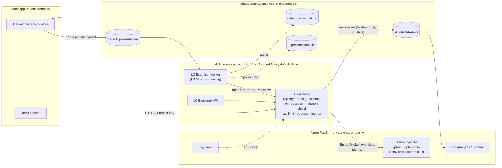

# Enterprise AI Platform — governed LLM access for a bank

A reference architecture and working implementation of a **bank-wide AI platform**:
one governed gateway through which every application consumes LLMs, event-driven
integration over **Kafka**, deployment on **Kubernetes (AKS)**, models from
**Azure OpenAI**, all provisioned with **Terraform** on **Azure**.

The first workload on the platform is a **trade-finance use case**: AI-assisted
examination of documentary credit (letter of credit) presentations against
**UCP 600** — a real, regulated, document-heavy banking process.

> Everything runs offline with a deterministic mock model (`docker compose up`),
> and switches to Azure OpenAI with two environment variables.

---

## Architecture



**Key principle:** applications never call a model directly. NetworkPolicies allow
LLM egress only from the gateway, and only the gateway's managed identity holds the
`Cognitive Services OpenAI User` role. Azure OpenAI has `local_auth_enabled = false`,
so there are no API keys that could leak.

---

## What's in the repo

| Path | What it is |
|---|---|
| `services/gateway` | **AI Gateway** (FastAPI, OpenAI-compatible API). Model registry, per-tenant allow-lists, data-classification routing, fallback chains, PII redaction (Czech birth numbers, IBAN mod-97, cards Luhn, e-mail, phone), prompt-injection shield (EN + CZ), token-bucket rate limiting, monthly budgets, Prometheus metrics, Kafka audit trail |
| `services/gateway/config/models.yaml` | **Model registry** — the governance artefact: which models exist, for which data, for whom, at what cost, with what fallback |
| `services/lc-examiner` | **LC examination service** — 12 deterministic UCP 600 rule groups (Art. 6, 14, 18, 20, 27, 28, 30, 31) + LLM review of goods-description correspondence (Art. 18(c)) via the gateway. Kafka worker (at-least-once, DLQ, graceful shutdown) and HTTP API |
| `eval/run_eval.py` | **Evaluation harness** — labelled golden set, per-rule precision/recall, CI quality gate |
| `deploy/k8s` | Kustomize: `base` (hardened Deployments, HPA, PDB, NetworkPolicies, PSS restricted), `overlays/kind` (local cluster + in-cluster Kafka), `overlays/azure` (Workload Identity, Key Vault CSI, Event Hubs, KEDA) |
| `infra/terraform` | AKS (Cilium, workload identity, Entra-only), Azure OpenAI + deployments, Event Hubs (Kafka), Key Vault, ACR, private endpoints + DNS, Log Analytics, RBAC |
| `.github/workflows` | CI: lint, tests, eval gate, kustomize + kubeconform, terraform validate, image build + Trivy scan. CD: OIDC-federated deploy to Azure (no stored secrets) |
| `docs/adr` | Architecture Decision Records |
| `docs/ai-standards.md` | Draft **AI platform standards & best practices** for the bank |

---

## Quick start

### 1. Unit tests + evaluation (no infrastructure needed)

```bash
pip install -r services/gateway/requirements.txt pytest pytest-asyncio
make test     # 36 tests
make eval     # UCP 600 golden set: 20 cases, per-rule precision/recall
```

### 2. Full local stack (Docker)

```bash
docker compose up --build -d          # Kafka (KRaft) + gateway + examiner API & worker + Kafka UI
pip install aiokafka
make demo                             # publish 2 LC presentations, print results from Kafka
```

* Gateway: http://localhost:8080/docs · Examiner: http://localhost:8081/docs · Kafka UI: http://localhost:8090

Synchronous call:

```bash
curl -s -X POST localhost:8081/v1/examine \
  -H 'content-type: application/json' \
  --data @samples/presentation_discrepant.json | jq
```

```text
PRES-0002  DISCREPANT  (examination deadline 2026-10-27 — Art. 14(b), 5 banking days)
  [discrepancy] Art. 14(c)        Presented 28 days after shipment; limit is 21
  [discrepancy] Art. 18(b), 30(a) Invoice 262000.00 exceeds credit amount 248000.00 (+5% tolerance = 260400.00)
  [discrepancy] Art. 27           Transport document carries clauses: 2 crates damaged, contents unchecked
  [discrepancy] Art. 14(a), 15    Missing required documents: ['certificate of origin']
  [discrepancy] Art. 28(f)(ii)    Insured 270000.00 < 110% of invoice value (288200.00)
  [discrepancy] Art. 18(c)        (LLM) Invoice describes 3-axis HMT-300 refurbished machines; credit calls for new 5-axis HMT-500 …
```

Call the gateway directly, like any bank application would:

```bash
curl -s localhost:8080/v1/chat/completions \
  -H 'x-api-key: dev-trade-finance-key' \
  -H 'x-data-classification: confidential' \
  -H 'content-type: application/json' \
  -d '{"model":"chat-default","messages":[{"role":"user","content":"Klient RČ 780123/3561, účet CZ65 0800 0000 1920 0014 5399"}]}'
# -> PII is redacted before the prompt leaves the gateway: "Klient RČ [BIRTH_NUMBER], účet [IBAN]"
```

**Real Azure OpenAI:** copy `.env.example` to `.env`, set `FORCE_MOCK_PROVIDER=false`
and `AZURE_OPENAI_ENDPOINT` (+ `AZURE_OPENAI_API_KEY` locally; in AKS the gateway
uses Workload Identity instead of keys).

### 3. Kubernetes (kind)

```bash
kind create cluster --name ai-platform
make kind-deploy
kubectl -n ai-platform get pods
```

### 4. Azure

```bash
cd infra/terraform && cp terraform.tfvars.example terraform.tfvars
terraform init && terraform apply
```

or run the `deploy-azure` GitHub workflow (OIDC federation — set `AZURE_CLIENT_ID`,
`AZURE_TENANT_ID`, `AZURE_SUBSCRIPTION_ID` as repository variables).

---

## Design decisions (short version)

| Concern | Decision | Why |
|---|---|---|
| LLM access | Central gateway, OpenAI-compatible API | One place for security, audit, cost and model lifecycle; apps stay provider-agnostic — [ADR-0001](docs/adr/0001-central-ai-gateway.md) |
| Integration | Kafka for audit trail and long-running AI work | Decouples AI latency from core systems, replayable, natural fit for document flows — [ADR-0002](docs/adr/0002-kafka-event-driven-ai.md) |
| Kafka in Azure | Event Hubs Kafka endpoint | No broker operations; same client code locally and in Azure — [ADR-0003](docs/adr/0003-event-hubs-kafka-endpoint.md) |
| Data protection | Classification header + registry clearance; fallbacks may never downgrade | Prevents a "silent" re-route of strictly confidential data to a less-cleared model — [ADR-0004](docs/adr/0004-data-classification-routing.md) |
| AI in a regulated decision | Rules decide, LLM can only add findings, human always signs off | Explainable to auditors; LLM outage or bad output degrades gracefully to rules-only — [ADR-0005](docs/adr/0005-human-in-the-loop-hybrid-ai.md) |
| Secrets | Entra ID everywhere (workload identity, OIDC CI), Key Vault for the rest | No long-lived credentials in cluster or GitHub |

---

## Roadmap

- Azure AI Content Safety Prompt Shields + groundedness detection as a second guardrail layer
- RAG over ISBP 821 and internal trade-finance policies (Azure AI Search, private endpoint)
- Global rate limiting via Azure API Management or Redis (currently per replica)
- OAUTHBEARER for Event Hubs (workload identity) instead of SAS connection strings
- OpenTelemetry tracing across gateway → Kafka → worker
- Bank-holiday calendar (CZ / TARGET2) for the Art. 14(b) examination deadline

## Author

**David Koktavý** 

## License

MIT
